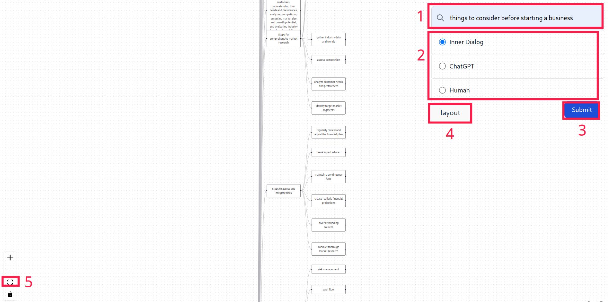

# Inner Dialog


- [Demo 網站](http://140.116.245.152:3210/) 架設在 **152 的 3210 port**
- 測試問句
    - things to consider before starting a business
    - things to consider before choosing a career
    - things to consider before having a baby
    - things to consider before buying a car
    - things to consider before traveling to a foreign country
    - things to consider before getting a credit card
- Model 選項說明
    - `inner_dialog`: 本論文系統
    - `chatgpt`: ChatGPT 5-round baseline
    - `extract`: Google Search 前 5 篇人類文章人工整理生成心智圖


## API 
架設在 **152 的 3211 port** ([API 測試](http://140.116.245.152:3211/docs))

- 呼叫方式

```shell
curl -X 'GET' \
  'http://140.116.245.152:3211/gen_mindmap/?question=things%20to%20consider%20before%20choosing%20a%20career&model=inner_dialog&token=xxx&use_cache=true&foce_write_cache=false' \
  -H 'accept: application/json'
```
- 參數說明
    - question (`string`): 輸入的開放式問句
    - model (`string`): 使用模型
        - `inner_dialog`: 本論文系統
        - `chatgpt`: ChatGPT 5-round baseline
        - `extract`: Google Search 前 5 篇人類文章人工整理生成心智圖
    - use_cache (`bool`): 是否使用 cache 資料 (速度較快)
    - force_write_cache (`boool`): 是否複寫 cache 資料 (當你想更新 cache 時請設為 `true`)
    - token (`string`): Mi2S API token. ([申請連結](http://140.116.245.150/api/login.php))
- Python 呼叫範例

```python
import requests
import json


def test_api():
    question = "things to consider before choosing a career"
    model = "inner_dialog"
    api_url = "http://140.116.245.152:3211/gen_mindmap/"
    res = requests.get(
        api_url,
        params={
            "question": question,
            "model": model,
            "use_cache": True,
            "force_write_cache": False,
            "token": "xxx",
        },
        headers={"Content-type": "application/json"},
    )

    if res.status_code == 200:
        print(res.content)
        data_dict = json.loads(res.content)
        print(data_dict)
    else:
        print("request failed")


if __name__ == "__main__":
    test_api()

```


## 準備開發環境
- [安裝 poetry](https://python-poetry.org/docs/#installation) Python 套件管理工具，本專案使用 **Python 3.10 以上**
- Clone 專案並進入專案資料夾
- 安裝 dependencies
```
$ poetry install
```
- 設定 OpenAI API key: 新增一個檔案 `.env`，複製 [.env.example](./.env.example) 這個檔案的內容到 `.env`，然後改寫你的 [OpenAI api key](https://platform.openai.com/account/api-keys) (我們使用 [dotenv](https://github.com/theskumar/python-dotenv) 這個套件管理 API key 這種資訊，**不要把 `.env` 內的 API key push 到 git 上**，我已經把 `.env` 加到 [.gitignore](./.gitignore))

## API
使用 [FastAPI](https://fastapi.tiangolo.com/) 架構 API server

- 啟動 API server
```
$ poetry run uvicorn inner_dialog.api:app --reload 
```
- 用網頁打開 [http://127.0.0.1:8000](http://127.0.0.1:8000)
- API documentation 網址 [http://127.0.0.1:8000/docs](http://127.0.0.1:8000/docs)


### 心智圖生成 API (`/gen_mindmap/`)
- input
  - question: string
  - model: string
  - use_cache: bool
  - force_write_cache: bool
- output: 
  - argument tree: JSON
- 可以測試
  - question: things to consider before starting a business
  - model: inner_dialog
  - use_cache: true
  - force_write_cache: false

## demo 網頁
使用 [React](https://react.dev/) 前端框架、[Vite](https://vitejs.dev/) 前端建構工具、[TypeScript](https://www.typescriptlang.org/) 撰寫前端程式碼、[Reactflow](https://reactflow.dev/) 繪製心智圖

- [安裝 NodeJS](https://nodejs.org/en/download)
- 到前端資料夾
```
$ cd inner_dialog/frontend
```
- 安裝前端 dependencies
```
$ npm install
```
- 執行開發網頁
```
$ npm run dev
```
- 如果開發完成準備發佈
```
$ npm run build
```
- 預覽待發佈的內容
```
$ npm run preview
```

## Code 架構
使用 [langchain](https://python.langchain.com/docs/get_started/introduction.html) 作為 large language model 介面


- [inner_dialog](./inner_dialog/)
  - [inner_dialog.py](./inner_dialog/inner_dialog.py): Inner Dialog 主程式
    - 執行這個檔案會產生 `inner_dialog_output` (模型對於開放式問題的最終答案) 以及 `inner_dialog.log` (紀錄每次問答的內容)
  - [experiment.py](./inner_dialog/experiment.py): 執行實驗的程式
  - [chatgpt.py](./inner_dialog/chatgpt.py): ChatGPT baseline
- [frontend](./frontend/): demo 網站，進入點 [App.tsx](./frontend/src/App.tsx)
- [data](./data/): 存放資料集、ChatGPT 快取 (省錢)
  - [t2cb.json](./data/t2cb.json): T2CB 資料集
  - [inner_dialog_cache.json](./data/inner_dialog_cache.json): Inner dialog cache，如果之前已經有問過的問題就會從這抓取，速度比較快，也可以省錢
  - [chatgpt_cache.json](./data/chatgpt_cache.json): ChatGPT cache，如果之前已經有問過的問題就會從這抓取，速度比較快，也可以省錢
- [experiment_result](./experiment_result/): 實驗結果歷史紀錄，為 [experiment.py](./inner_dialog/experiment.py) 的輸出，如果之後還有做其他實驗可以存放在這裡(記得上時間戳)
- [logs](./logs/): 實驗結果的詳細 log 存放處，大多為 [inner_dialog.py](./inner_dialog/inner_dialog.py) 的輸出
- [tests](./tests/): 測試檔，測試檔名有做 mapping (e.g., `inner_dialog/utils.py` 對應的測試檔為 `tests/test_utils.py`)
- [pyproject.toml](./pyproject.toml): 這個 project 的 dependencies，以及使用的 Python 版本

## Deploy
- Use docker-compose to build app and API together. (Replace `localhost` with product server IP)
```
$ IP=localhost docker-compose up --build -d
```
- Tear down compose.
```
$ docker-compose down
```

### Or spin up app and api docker seperatly.
- Build demo app docker
```
$ cd frontend
$ docker build -t inner_dialog_app . --build-arg VITE_API_URL=http://localhost:3211
$ docker run -d --name inner_dialog_app -p 3210:80 inner_dialog_app:latest
```
- Build API docker
```
$ docker build -t inner_dialog_api .
$ docker run -d --name inner_dialog_api -p 3211:80 inner_dialog_api:latest
```